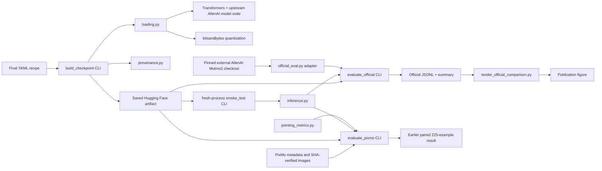

 # Codebase guide

This document explains what each directory and file does, how the pieces depend
on one another, and which code belongs to this project versus AllenAI.

## The short answer about code ownership

All tracked Python code under `src/molmo_quant/`, `scripts/`, and `tests/` is
project-authored integration, quantization, evaluation, reporting, or test code
developed for this repository. **AllenAI's Molmo2 evaluation source is not
copied into those directories.**

AllenAI code enters the system in three explicit ways:

1. `transformers` loads the upstream MolmoPoint architecture and processor code
   from `allenai/MolmoPoint-8B` using `trust_remote_code=True`.
2. Official evaluation receives a separate Molmo2 checkout through
   `--official-source`. Our adapter imports AllenAI's formatter, dataset, and
   evaluator classes from that checkout at runtime.
3. Saved checkpoints under `artifacts/` contain upstream AllenAI modeling and
   processor `.py` files copied by the Hugging Face save/package process. This
   is intentional: it lets a published checkpoint load with a normal native
   Transformers call. Those copied artifact files are upstream code, not
   project-authored code.

The official evaluation checkout used for the reproduced results was
`/tmp/molmo2-official` at commit
`f3cb1085fbb97c4a4d7fdcadd77cf871bf37a88a`. It is an external working copy,
not part of this repository and not intended for publication with it.

## Recommended reading order

To understand the release path without reading every experiment, use this
order:

1. `configs/int4.yaml` and `configs/int8.yaml` — the two final recipes.
2. `src/molmo_quant/loading.py` — how models are quantized and loaded.
3. `src/molmo_quant/inference.py` — the shared deterministic inference path.
4. `src/molmo_quant/cli/build_checkpoint.py` — how a distributable checkpoint
   is built and validated.
5. `src/molmo_quant/cli/evaluate_official.py` and
   `src/molmo_quant/official_eval.py` — the official evaluation bridge.
6. `results/official-evaluation.md` — the reviewed release evidence.

The `configs/ablations/` directory and the older paired evaluator can be read
later when the reason for the final INT4 design matters.

## Top-level directories

| Path | Purpose | Origin | Publish? |
|---|---|---|---:|
| `src/molmo_quant/` | Installable implementation and command-line logic | Project-authored | Yes |
| `scripts/` | Source-tree launchers and standalone reporting/data helpers | Project-authored | Yes |
| `configs/` | Final quantization recipes and rejected INT4 ablations | Project-authored | Yes |
| `tests/` | Lightweight unit tests; no weights or GPU required | Project-authored | Yes |
| `model_cards/` | Draft Hugging Face cards for the final INT4 and INT8 releases | Project-authored | Yes |
| `results/` | Reviewed reports, small summaries, and publication figures | Project-authored outputs | Yes, selected files |
| `artifacts/` | Large locally generated model repositories | Mixed: quantized weights plus copied upstream files | No; upload final artifacts to Hugging Face |
| `data/` | Downloaded datasets, masks, images, and caches | External data plus generated cache metadata | No |
| `.idea/` | Local IDE metadata | Tool-generated | No |
| `.agents/`, `.codex/` | Codex workspace/runtime mounts, not project logic | Tool-generated | No |

`artifacts/`, `data/`, raw JSONL evaluation output, and model weights are ignored
by Git. Reviewed Markdown, figures, and official summary JSON files are the
portable evidence intended for the repository.

## Main dependency flows

There are two evaluation paths on purpose:

- **Official release-quality path:** `evaluate_official.py` plus
  `official_eval.py`. It calls AllenAI's actual formatter and evaluator classes.
- **Earlier paired-agreement path:** `evaluate_pixmo.py` plus
  `pointing_metrics.py`. It uses a fixed prompt so BF16, INT4, and INT8 outputs
  can be compared example by example. It is useful for agreement diagnostics,
  but is not labeled as the official protocol.

## `src/molmo_quant/`: reusable implementation

### Core modules

| File | Responsibility | Used by |
|---|---|---|
| `config.py` | Parses and validates build YAML; defines BF16/INT4/INT8 and the final INT4 BF16-exclusion list | Build and smoke CLIs, `loading.py` |
| `loading.py` | Single source of truth for upstream loading, bitsandbytes configuration, and native saved-checkpoint loading | Build, smoke, paired evaluation, official evaluation |
| `inference.py` | Prepares one image/prompt, performs greedy generation, decodes text and points, and measures latency/VRAM | Smoke, paired evaluation, official evaluation |
| `provenance.py` | Resolves immutable upstream revisions, packages processor assets, records environment/config metadata, and writes JSON | Build and reporting CLIs |
| `compatibility.py` | Optional diagnostic patch for the rejected fully-INT8 prototype's high-rank bitsandbytes issue | Only smoke testing when explicitly requested |
| `metrics.py` | Simple BF16-relative token and coordinate comparison for one-image smoke tests | `compare_variants`, `summarize_smoke` |
| `pixmo_dataset.py` | Loads PixMo metadata, downloads external images, verifies SHA256, and manages the local manifest | Earlier paired evaluation preparation |
| `pointing_metrics.py` | Local mask/Hungarian pointing metric and BF16-relative coordinate matching | Earlier paired evaluation only |
| `official_eval.py` | Thin bridge to the pinned external AllenAI evaluator: commit check, official prompt formatting, official dataset loading, scoring, and summaries | Official evaluation CLI only |
| `__init__.py` | Package metadata and public `BuildConfig`/`Variant` exports | Package import |

### What `official_eval.py` imports from AllenAI

The adapter is project-authored, but these classes/functions come directly from
the separate pinned Molmo2 checkout at runtime:

- `PointBench` and `PixMoPointsEval` — official dataset parsing.
- `MolmoPointDataFormatter` and `make_random_state` — deterministic official
  `uber_model_v2` prompt construction.
- `PointBenchEval` and `PointingEval` — official scoring.
- `UnifiedPointFormatter` — AllenAI's canonical coordinate serialization.

This boundary is deliberate: the repository controls model loading and result
recording, while AllenAI controls the benchmark semantics.

## `src/molmo_quant/cli/`: actual command implementations

| File | Installed command | Responsibility |
|---|---|---|
| `build_checkpoint.py` | `molmo-quant-build` | Build, save, package, and fresh-process-check one quantized checkpoint |
| `smoke_test.py` | `molmo-quant-smoke` | Run one model/image and write structured JSON evidence |
| `compare_variants.py` | `molmo-quant-compare` | Launch BF16/INT4/INT8 smoke runs in isolated processes and compare them |
| `summarize_smoke.py` | `molmo-quant-summarize` | Summarize already completed smoke JSON files |
| `prepare_pixmo_eval.py` | `molmo-quant-prepare-pixmo` | Download and SHA-verify images for the earlier paired evaluation |
| `evaluate_pixmo.py` | `molmo-quant-eval-pixmo` | Run one variant through the fixed-prompt paired evaluator with resumable JSONL |
| `summarize_pixmo.py` | `molmo-quant-summarize-pixmo` | Join three paired runs and produce agreement/result reports |
| `evaluate_official.py` | `molmo-quant-eval-official` | Run one variant with the official formatter/evaluator and resumable JSONL |
| `__init__.py` | None | Marks the CLI package |

Each model variant is evaluated in a separate process. This prevents CUDA
state or optional diagnostic patches from leaking from one model into another.

## `scripts/`: wrappers and standalone helpers

Most files here are intentionally tiny wrappers around `src/molmo_quant/cli/`.
They allow a command to run from a source checkout with `PYTHONPATH=src` before
the package is installed. The installed `molmo-quant-*` commands in
`pyproject.toml` call the same underlying `main()` functions.

| File | Type | Responsibility |
|---|---|---|
| `build_checkpoint.py` | Thin wrapper | Calls `molmo_quant.cli.build_checkpoint.main` |
| `smoke_test.py` | Thin wrapper | Calls `molmo_quant.cli.smoke_test.main` |
| `compare_variants.py` | Thin wrapper | Calls `molmo_quant.cli.compare_variants.main` |
| `summarize_smoke.py` | Thin wrapper | Calls `molmo_quant.cli.summarize_smoke.main` |
| `prepare_pixmo_eval.py` | Thin wrapper | Calls `molmo_quant.cli.prepare_pixmo_eval.main` |
| `evaluate_pixmo.py` | Thin wrapper | Calls `molmo_quant.cli.evaluate_pixmo.main` |
| `summarize_pixmo.py` | Thin wrapper | Calls `molmo_quant.cli.summarize_pixmo.main` |
| `evaluate_official.py` | Thin wrapper | Calls `molmo_quant.cli.evaluate_official.main` |
| `build_pixmo_official_union.py` | Standalone helper | Combines two independently SHA-verified PixMo caches while retaining original source indices |
| `render_example_comparison.py` | Standalone reporting tool | Draws BF16/INT8/INT4 points on one difficult example |
| `render_official_comparison.py` | Standalone reporting tool | Regenerates the simple official F1-versus-memory figure from summary JSON |

## `configs/`: final recipes versus experiments

| File | Status | Meaning |
|---|---|---|
| `int4.yaml` | **Final release** | NF4 language transformer; vision encoder, connector, visual embedding, and pointing head remain BF16 |
| `int8.yaml` | **Final release** | LLM.int8 for eligible layers; pointing head remains BF16 for native compatibility |
| `evaluation.yaml` | Earlier paired evaluation | Fixed-prompt configuration; not the official prompt protocol |
| `ablations/int4-no-double-quant.yaml` | Rejected experiment | Tests NF4 without double quantization |
| `ablations/int4-point-head-bf16.yaml` | Rejected experiment | Keeps only the pointing head BF16 |
| `ablations/int4-vision-bridge-bf16.yaml` | Rejected experiment | Keeps connector/visual embedding/pointing head BF16, but still quantizes the vision encoder |

Only `configs/int4.yaml` and `configs/int8.yaml` should be used to build release
weights.

## `artifacts/`: generated model repositories

Only these two directories are current release candidates:

| Directory | Status |
|---|---|
| `MolmoPoint-8B-bnb-nf4-vision-bf16` | **Final INT4** |
| `MolmoPoint-8B-bnb-int8-native` | **Final INT8** |
| `MolmoPoint-8B-bnb-nf4` | Rejected original NF4 prototype |
| `MolmoPoint-8B-bnb-nf4-no-double-quant` | Rejected ablation |
| `MolmoPoint-8B-bnb-nf4-point-head-bf16` | Rejected ablation |
| `MolmoPoint-8B-bnb-nf4-vision-bridge-bf16` | Rejected ablation |
| `MolmoPoint-8B-bnb-int8` | Rejected fully-INT8 prototype requiring a runtime patch |

Inside a final artifact:

- `model-*.safetensors` and the index are generated quantized weights.
- `quantization_provenance.json` is generated by this project.
- `config.json` records the packaged model/quantization configuration.
- `modeling_molmo*.py`, `configuration_molmo*.py`, and processor/image/video
  `.py` files are copied upstream AllenAI custom code required for native
  Transformers loading.
- tokenizer, processor, and generation files are copied upstream assets.

Nothing under `artifacts/` is imported by the project source unless its path is
explicitly passed as `--model`.

## `data/`: external and generated evaluation inputs

| Path | Purpose |
|---|---|
| `data/pixmo-points-eval/` | Earlier downloader's SHA-verified image cache and manifest; 225 evaluated rows |
| `data/official/source/` | Hugging Face PixMo metadata/parquet used during official recovery |
| `data/official/torch_datasets/point_arena/` | Complete downloaded PointBench data; 982 examples |
| `data/official/torch_datasets/pixmo_images/` | Images recovered through AllenAI's downloader |
| `data/official/torch_datasets/pixmo_datasets/` | AllenAI-format PixMo datasets, including the 231-row verified union |
| `data/official/hf-cache/` | Local Hugging Face download/cache material |

These files are inputs or caches, not source code. PixMo image availability is
why the official-protocol report is 231/436 rather than a full 436/436 result.

## `results/`: evidence and generated output

| Path | Meaning |
|---|---|
| `official-evaluation.md` | Primary reviewed official-protocol report |
| `official/point-bench/*-summary.json` | Small machine-readable summaries of the three complete 982-example runs |
| `official/pointing-eval-v2/*-summary.json` | Small summaries of the three 231/436 official-scorer runs |
| `official/**/*.jsonl` | Large raw per-example predictions; local and Git-ignored |
| `pixmo-points-eval.md` | Earlier 225-example fixed-prompt paired-agreement report |
| `int4-ablation.md` | Evidence used to select the final INT4 recipe |
| `figures/official-f1-memory.png` | Main simple publication figure |
| `figures/problematic-example-103.png` | Qualitative BF16/INT8/INT4 example |
| `README.md` | Short index to the release evidence |

New public claims should use `official-evaluation.md` first. Use the older
paired report only when discussing output agreement or how the INT4 recipe was
selected.

## `model_cards/`

- `model_cards/int4/README.md` documents the final mixed-precision NF4 release.
- `model_cards/int8/README.md` documents the final native INT8 release.

Both are project-authored derivative model cards. They inherit upstream model
attribution and licensing metadata, but the quantization description, usage,
results, and limitations describe this project.

## `tests/`

| File | Covers |
|---|---|
| `test_config.py` | YAML parsing, final recipes, and validation rules |
| `test_compatibility.py` | Optional high-rank INT8 diagnostic patch |
| `test_metrics.py` | Smoke-test token and coordinate agreement |
| `test_pointing_metrics.py` | Local paired pointing metric behavior |
| `test_official_eval.py` | Official summary aggregation and coverage labeling |
| `test_provenance.py` | Processor asset/provenance helpers |

These tests validate our integration logic. They do not duplicate AllenAI's
own tests and do not claim to unit-test the upstream model or official
evaluator internals.

## External Python dependencies

`pyproject.toml` is the source of truth for normal project dependencies:

- PyTorch, torchvision, Transformers, accelerate, and bitsandbytes for model
  loading, inference, and quantization.
- Pillow, NumPy, PyYAML, and Hugging Face Hub utilities for common support.
- The optional `eval` extra adds datasets, PyArrow, and SciPy for the earlier
  paired evaluation.
- The optional `dev` extra adds pytest and Ruff.

Official evaluation additionally requires the pinned external Molmo2 checkout
and the subset of its dependencies exercised by its dataset formatter and
evaluator. Those packages are dependencies of AllenAI's checkout; the checkout
itself is deliberately not vendored or declared as if it were this project's
source.

## Where to make common changes

| Goal | Primary file(s) |
|---|---|
| Change the final quantization recipe | `configs/int4.yaml` or `configs/int8.yaml`, then rebuild |
| Change how every model is loaded | `src/molmo_quant/loading.py` |
| Change shared generation/point decoding | `src/molmo_quant/inference.py` |
| Change checkpoint packaging/provenance | `src/molmo_quant/provenance.py` and the build CLI |
| Change the earlier paired agreement test | `evaluate_pixmo.py`, `pointing_metrics.py`, `summarize_pixmo.py` |
| Change official-evaluation integration | `official_eval.py` and `cli/evaluate_official.py` |
| Change the main figure | `scripts/render_official_comparison.py` |
| Change Hugging Face presentation | `model_cards/int4/README.md` and `model_cards/int8/README.md` |

The final release path does not use any file under `configs/ablations/`, the
rejected artifact directories, or `compatibility.py` unless the diagnostic flag
is explicitly requested.
