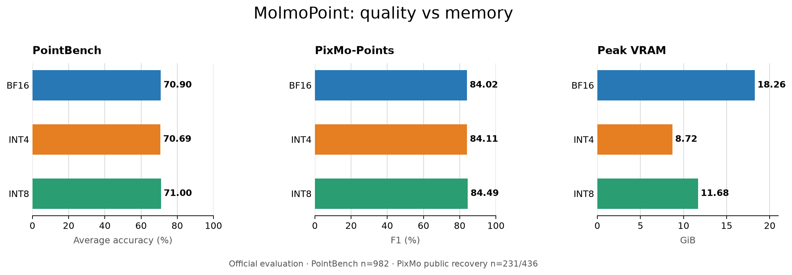

# MolmoPoint-8B — NF4 language model with BF16 vision

This is a mixed-precision, inference-ready quantization of
[`allenai/MolmoPoint-8B`](https://huggingface.co/allenai/MolmoPoint-8B). The
7.6B-parameter language transformer uses bitsandbytes NF4 with BF16 compute and
double quantization. The vision encoder, multimodal connector, visual embedding
projection, and pointing head remain BF16 to preserve pointing behavior.

This is intentionally not an entirely 4-bit model. Quantizing the visual path
caused substantial pointing degradation during recipe selection.

## Evaluation overview



The figure compares both released quantizations with the BF16 baseline. See
[Evaluation](#evaluation) for coverage, protocol, and metric details.

## Model details

- **Repository:** `erdi28/MolmoPoint-8B-bnb-nf4-vision-bf16`
- **Base model:** `allenai/MolmoPoint-8B`
- **Base revision:** `188130f961c8e0888a34e11121a1423c461a01ba`
- **Quantized:** MolmoPoint language transformer
- **Retained in BF16:** vision encoder, connector, visual embedding projection,
  and pointing head
- **Quantization:** NF4, BF16 compute, double quantization
- **Local checkpoint size:** approximately 7.08 GB (6.59 GiB)
- **Source and evaluation code:**
  [`erkara/molmopoint-quantization`](https://github.com/erkara/molmopoint-quantization)

The included `quantization_provenance.json` records the resolved base revision,
complete quantization recipe, software versions, and build environment.

## Requirements

The checkpoint was built and validated with Python 3.12, Transformers 4.57.1,
bitsandbytes 0.50.0, and a CUDA-capable NVIDIA GPU. It contains the processor and
trusted custom model code required for native Transformers loading.

```bash
pip install "transformers==4.57.1" "bitsandbytes==0.50.0" accelerate torch torchvision pillow einops decord2
```

## Usage

```python
import torch
from PIL import Image
from huggingface_hub import hf_hub_download
from transformers import AutoModelForImageTextToText, AutoProcessor

repo_id = "erdi28/MolmoPoint-8B-bnb-nf4-vision-bf16"

processor = AutoProcessor.from_pretrained(
    repo_id,
    trust_remote_code=True,
    padding_side="left",
    use_fast=False,
)
model = AutoModelForImageTextToText.from_pretrained(
    repo_id,
    trust_remote_code=True,
    dtype="auto",
    device_map="auto",
)
model.eval()

image_path = hf_hub_download(repo_id, "examples/pointing-demo.jpg")
image = Image.open(image_path).convert("RGB")
prompt = "Point to the tool that people can use to write."
messages = [{
    "role": "user",
    "content": [
        {"type": "text", "text": prompt},
        {"type": "image", "image": image},
    ],
}]

inputs = processor.apply_chat_template(
    messages,
    tokenize=True,
    add_generation_prompt=True,
    return_tensors="pt",
    return_dict=True,
    padding=True,
    return_pointing_metadata=True,
)
metadata = inputs.pop("metadata")
inputs = {name: value.to("cuda") for name, value in inputs.items()}
prompt_length = inputs["input_ids"].shape[1]

with torch.inference_mode(), torch.autocast("cuda", dtype=torch.bfloat16):
    output = model.generate(
        **inputs,
        logits_processor=model.build_logit_processor_from_inputs(inputs),
        do_sample=False,
        max_new_tokens=128,
    )

generated = output[:, prompt_length:]
generated_text = processor.post_process_image_text_to_text(
    generated,
    skip_special_tokens=False,
    clean_up_tokenization_spaces=False,
)[0]
points = model.extract_image_points(
    generated_text,
    metadata["token_pooling"],
    metadata["subpatch_mapping"],
    metadata["image_sizes"],
)

print(generated_text)
print(points)
```

### Example output


This checkpoint returns two points near `(336, 100)` and `(627, 187)` in the
1200 x 800 source image, corresponding to the blue and red mechanical pencils.
The demo image is a compressed copy of a
[CC0 Public Domain image from PxHere](https://pxhere.com/en/photo/899556).
MolmoPoint emits special grounding tokens, which `extract_image_points`
converts into source-image coordinates.

## Evaluation

All results use greedy decoding, batch size 1, the `uber_model_v2` prompt
templates, and AllenAI's official Molmo2 formatter and evaluators pinned to
commit `f3cb1085fbb97c4a4d7fdcadd77cf871bf37a88a`.

| Benchmark | Coverage | BF16 base | This checkpoint | Delta |
|---|---:|---:|---:|---:|
| PointBench average accuracy | 982/982 | 70.90% | 70.69% | -0.21 pt |
| PixMo-Points F1 | 231/436 | 84.02% | 84.11% | +0.08 pt |

All selected examples passed with zero evaluation failures. PointBench is a
complete public evaluation. PixMo-Points publishes 436 metadata rows through
[`allenai/pixmo-points-eval`](https://huggingface.co/datasets/allenai/pixmo-points-eval),
but only 231 external image URLs still returned bytes matching the published
SHA-256 hashes. The PixMo score therefore has 52.98% public-data coverage and is
not directly comparable with the paper's full-dataset result.

| Measurement | BF16 base | This checkpoint |
|---|---:|---:|
| Peak allocated VRAM across both evaluations | 18.26 GiB | 8.72 GiB |
| PointBench mean inference time | 1.4611 s/example | 1.4033 s/example |
| PixMo-Points mean inference time | 1.0026 s/example | 0.9720 s/example |

Peak allocated VRAM was 52.3% lower than BF16 on the benchmark system. Memory
and latency are environment-specific and should not be treated as universal
hardware requirements or speed guarantees. Full category scores, protocol
details, and recipe-selection evidence are available in the
[project results](https://github.com/erkara/molmopoint-quantization/blob/main/RESULTS.md).

## Intended use

This checkpoint is intended for research, evaluation, and CUDA inference where
lower memory use is useful and MolmoPoint's image, multi-image, video, and
grounding capabilities are required. It is a quantized derivative, not a
fine-tuned model, and does not add new capabilities or safety training.

## Limitations

This release inherits the base model's limitations, biases, and failure modes.
Quantization can change individual generations even when aggregate scores are
close. The evaluation does not establish identical or lossless behavior, and
PixMo-Points coverage is partial. Loading requires `trust_remote_code=True` and
a CUDA environment supported by bitsandbytes.

## License and responsible use

This derivative retains the base model's Apache-2.0 license and attribution.
Use is also subject to Ai2's
[Responsible Use Guidelines](https://allenai.org/responsible-use). The upstream
model card states that MolmoPoint-8B was trained on third-party datasets subject
to academic and non-commercial research-use terms. Review the
[base model card](https://huggingface.co/allenai/MolmoPoint-8B) and applicable
source-dataset terms before use or redistribution.
