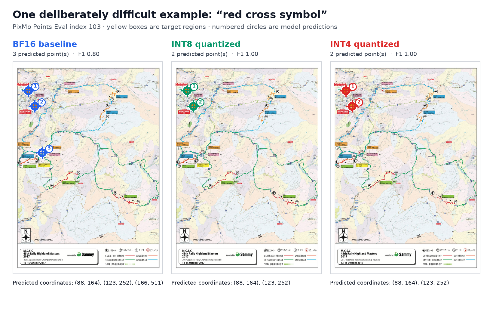

# Release evidence

The primary task-quality evidence is the newly reproduced official protocol in
[official-evaluation.md](official-evaluation.md): full PointBench (982/982) and
AllenAI PointingEval on all currently recoverable PixMo-Points rows (231/436).
The separate paired-output analysis is reported in
[pixmo-points-eval.md](pixmo-points-eval.md). The INT4 entry in both reports is
the production mixed-precision recipe: NF4 for the language transformer and
BF16 for the visual path and pointing head.

The experiments that selected this recipe are reported in
[int4-ablation.md](int4-ablation.md). The earlier all-layer-NF4 checkpoint is
shown there only as a rejected ablation and is not a release candidate.
The rejected checkpoints' small metadata records are retained in
[artifact-provenance/](artifact-provenance/); their large local weight
directories have been removed.

## Native-load smoke test

The production checkpoint was saved and loaded in a fresh process using the
ordinary Transformers `from_pretrained()` path, without a project runtime
patch. On PixMo Points Eval index 1 with the prompt `Point to the black bomb.`,
all variants found all three targets and scored F1 1.0.

| Variant | Native load | Exact tokens vs BF16 | Maximum point difference | Peak allocated VRAM | Inference time |
|---|---:|---:|---:|---:|---:|
| BF16 | Yes | Baseline | Baseline | 17.42 GiB | 1.63 s |
| Language NF4 + BF16 vision | Yes | No | 2.35 px | 7.82 GiB | 1.35 s |
| LLM.int8 + BF16 pointing head | Yes | Yes | 0.00 px | 10.54 GiB | 1.74 s |

The INT4 output differs from BF16 in one coordinate token: two points are
identical and the third is shifted vertically by 2.35 pixels. This smoke test
establishes packaging and native loading. The official-protocol report is the
task-quality evidence; the 225-example paired benchmark provides additional
output-agreement diagnostics.

## INT4 design decision

The release recipe keeps `model.vit`, `model.connector`,
`model.build_vit_embedding`, and `model.point_predictor` in BF16. The saved
checkpoint contains NF4 quantization state for the language transformer and
none for those excluded modules. It occupies 7.08 GB (about 6.59 GiB).

On the paired benchmark it reaches F1 0.8355 versus BF16's 0.8360, with 63.56%
exact generated-token agreement and 69.78% exact point-set agreement. These
results support “high agreement on tested examples,” not “lossless” or
“identical.”

## INT8 design decision

A fully INT8 checkpoint was also tested. Its packed weights loaded, but native
inference failed because bitsandbytes 0.50.0 applies a non-contiguous `.view()`
inside its outlier path when MolmoPoint sends a high-rank tensor through the
pointing head. A process-wide compatibility patch made that checkpoint run,
but requiring users to install a monkey patch conflicts with the frictionless
loading goal.

The INT8 release therefore keeps only `model.point_predictor` in BF16 and
quantizes all other eligible linear modules to INT8. It passes native
`from_pretrained()` inference without project compatibility code.

## Reproducibility notes

Runs used upstream commit `188130f961c8e0888a34e11121a1423c461a01ba`, an
NVIDIA GeForce RTX 5090 Laptop GPU, PyTorch
`2.10.0.dev20250916+cu130`, Transformers `4.57.1`, and bitsandbytes `0.50.0`.
Timings are environment-specific and should not be treated as stable
performance guarantees.
