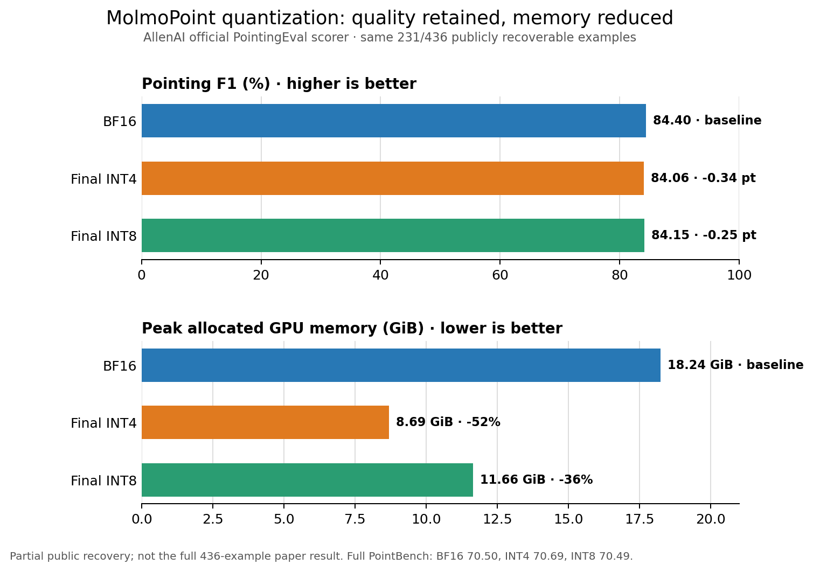

# Official-protocol evaluation

This report separates two kinds of evidence:

1. **New official-protocol reproduction:** AllenAI's pinned Molmo2 data
   formatter and evaluator code, with identical settings for BF16, the final
   INT4 checkpoint, and the final INT8 checkpoint.
2. **Earlier paired subset:** the repository's fixed-prompt 225-example run,
   retained only for detailed BF16-output agreement analysis.

The official code was pinned to Molmo2 commit
`f3cb1085fbb97c4a4d7fdcadd77cf871bf37a88a`. All variants used the
`uber_model_v2` evaluation prompt templates, greedy decoding, batch size 1,
and the same example order. Raw predictions are stored under
`results/official/` and are resumable by source index.

## PointBench — full official task

All 982 public PointBench examples were evaluated successfully for every
variant with AllenAI's `PointBenchEval`. Values are percentages; the average is
the unweighted mean of the five official categories.

| Variant | Affordable | Counting | Reasoning | Spatial | Steerable | Average | Peak VRAM |
|---|---:|---:|---:|---:|---:|---:|---:|
| BF16 | 86.36 | 72.45 | 77.72 | 77.95 | 38.00 | 70.50 | 18.24 GiB |
| **Final INT4** | **86.87** | **75.51** | **74.09** | **78.46** | **38.50** | **70.69** | **8.69 GiB** |
| **Final INT8** | **86.36** | **72.96** | **76.68** | **76.92** | **39.50** | **70.49** | **11.66 GiB** |

The reproduced BF16 average, 70.50%, is close to the 70.7 reported for
MolmoPoint-8B in the paper. INT4 is +0.19 percentage points and INT8 is -0.01
points relative to the reproduced BF16 run. The small positive INT4 difference
should be interpreted as discrete prediction variation, not as evidence that
quantization improves the base model.

## PixMo-Points / PointingEval — official protocol, partial public recovery

The Hugging Face dataset currently exposes all 436 rows of metadata, hashes,
masks, and source URLs, but not the image bytes. After running AllenAI's
official SHA-verified downloader and combining it with the earlier verified
cache, 231 unique task rows could be recovered. The other 205 source images
were changed or unavailable at their external URLs. Consequently, the table
below is an **official-scorer result on 231/436 examples (52.98% coverage)**,
not a full-task reproduction and not directly comparable with the paper's
full-dataset score.

| Variant | Examples | Precision | Recall | F1 | F1 delta vs BF16 | Peak VRAM |
|---|---:|---:|---:|---:|---:|---:|
| BF16 | 231/436 | 86.43 | 83.93 | 84.40 | baseline | 18.24 GiB |
| **Final INT4** | **231/436** | **86.12** | **83.70** | **84.06** | **-0.34 pt** | **8.69 GiB** |
| **Final INT8** | **231/436** | **86.21** | **83.61** | **84.15** | **-0.25 pt** | **11.66 GiB** |

INT4 reduces peak allocated GPU memory by 52.3% and retains the reproduced F1
within 0.34 points. INT8 reduces memory by 36.1% and remains within 0.25 F1
points. Peak VRAM is hardware- and software-version-specific; it is included as
a same-machine comparison rather than a universal requirement.

## Earlier 225-example paired subset — separate result

These older numbers used the fixed prompt `Point to the {label}.` and the
repository's paired-comparison path. They are useful for token, point-count,
and coordinate agreement with BF16, but they are not mixed with the newly
reproduced official-protocol result.

| Variant | Examples | Precision | Recall | F1 |
|---|---:|---:|---:|---:|
| BF16 | 225 | 85.85 | 83.07 | 83.60 |
| Final INT4 | 225 | 85.96 | 83.06 | 83.55 |
| Final INT8 | 225 | 85.11 | 82.70 | 83.16 |

See [pixmo-points-eval.md](pixmo-points-eval.md) for the paired agreement
statistics and [int4-ablation.md](int4-ablation.md) for the experiments that
selected the final mixed-precision INT4 recipe.

## Exact release artifacts

- BF16: `allenai/MolmoPoint-8B`, revision
  `188130f961c8e0888a34e11121a1423c461a01ba`
- Final INT4: `artifacts/MolmoPoint-8B-bnb-nf4-vision-bf16`
- Final INT8: `artifacts/MolmoPoint-8B-bnb-int8-native`

No rejected ablation checkpoint was included in these runs.
